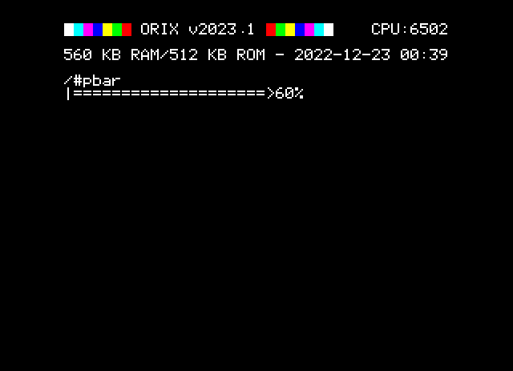

# Simple lib for a progress bar



example folder contains a pbar.c example program

## informations for C

This returns a pbar ptr struct (a malloc to the Orix kernel), arg is the type of the pbar, for instance one pbar type is available

 * struct pbar *pbarInit(unsigned char pbartype);

pbarRun display the next percentage and the next char for the progressbar. Each type the pbarRun is called, the bar add "3%" to the current percentage.
Step arg is not used yet. pbarRun must be called 34 times to have almost the complete bar. pbarEnd will displays 100%  and will free pbar struct.

* void pbarRun(unsigned char step, struct pbar *ptr);

pbarEnd finishes the bar and free the pbar ptr

* void pbarEnd(struct pbar *ptr);*

## information in ASM

A contains the type of the progressbar (not used yet), must be initialized with PBAR_TYPE_SLIDE_EQUAL
X = 3 (step but not used)
Y = 0 (not used, but Y must be set to 0)

```ca65
lda         #PBAR_TYPE_SLIDE_EQUAL
ldx         #3
ldy         #0
jsr         pbarInit
```

; A and X contains the ptr of the pbar struct

start progressBar

```ca65
ldy         #3 ; Step not used yet, but for future, let's keep 3
lda         #<ptr_struct_progressbar ; (from pbarInit )
ldx         #>ptr_struct_progressbar ; (from pbarInit )

jsr         pbarRun
```

Displays 100% and free progressbar

```ca65
lda         #<ptr_struct_progressbar ; (from pbarInit )
ldx         #>ptr_struct_progressbar ; (from pbarInit )

jsr         pbarEnd
```
